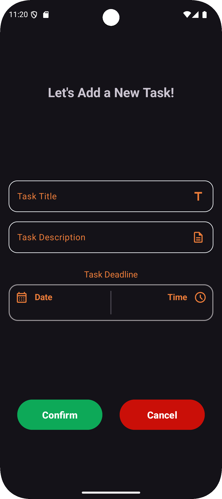
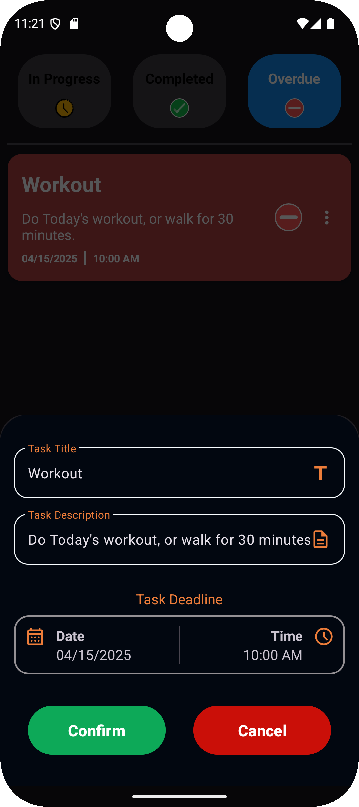
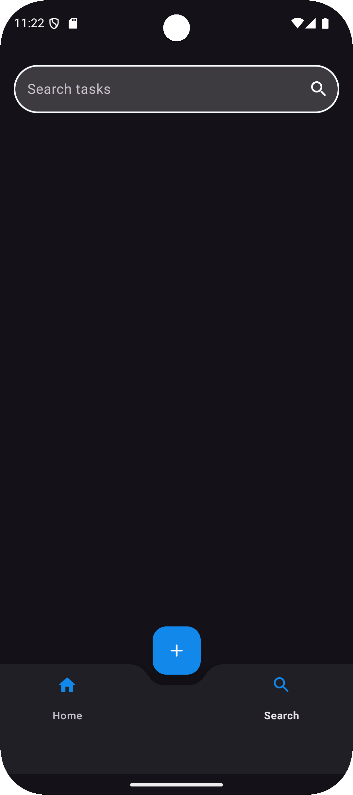
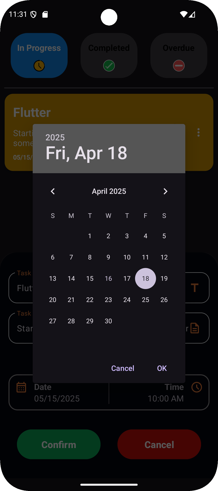

# ✅ DoIt - Task Manager

**DoIt** is a modern Android **To-Do list app** built using **Kotlin** and the **MVVM architecture**. It focuses on efficient offline task management with features like deadlines, categorization, and task filtering. The app was developed as a personal learning project to master **Room**, **ViewModel**, **coroutines**, and architecture components in Android.

---

## Features

- Add, edit, and delete tasks with full details
- Set task deadlines with **date and time pickers**
- Search tasks by title or description
- Filter tasks into **In Progress**, **Completed**, and **Missed** using tabs
- Navigation via **TabLayout** and Bottom Navigation
- Beautiful splash screen using **Lottie** animation
- Smooth task management with a clean UI and responsive design

---

## Concepts Applied

- **Room Database** setup with **DAO**, **Entities**, **Repository**
- **TypeConverters** for custom models and `DateTime`
- **Singleton pattern** for database provider
- **MVVM architecture** (ViewModel + Repository + DAO)
- **LiveData** for observing changes
- **Coroutines** for background database operations
- RecyclerView Adapter with efficient updates
- **ViewModel Factory** (first-time usage)
- Custom Toasts using `StyleableToast`
- Splash screen with **Lottie** animations

---

## Tech Stack

- **Kotlin**
- **MVVM Architecture**
- **Room Database**
- **ViewModel & LiveData**
- **Coroutines**
- **TabLayout + BottomNavigationView**
- **View Binding**
- **RecyclerView**
- **Lottie for splash animation**
- **StyleableToast** for custom toasts

---

## Dependencies

```kotlin
implementation(libs.androidx.lifecycle.viewmodel.ktx)
implementation(libs.androidx.lifecycle.livedata.ktx)
implementation(libs.androidx.room.runtime)
ksp(libs.androidx.room.compiler)
implementation(libs.androidx.room.ktx)
implementation(libs.lottie)
implementation(libs.styleabletoast)
```

---

## Setup & Installation

1. Clone the repository
```bash
git clone https://github.com/M0hamed-Awad/DoIt.git
```
2. Open the project in **Android Studio**
3. Sync Gradle and ensure the following dependencies are included:

```kotlin
implementation(libs.androidx.lifecycle.viewmodel.ktx)
implementation(libs.androidx.lifecycle.livedata.ktx)
implementation(libs.androidx.room.runtime)
ksp(libs.androidx.room.compiler)
implementation(libs.androidx.room.ktx)
implementation(libs.styleabletoast)
implementation(libs.lottie)
```

---

## Screenshots

- **Task list [In Progress] Screen**  
  ![Task list [In Progress] Screen](screenshots/In_Progress_Tasks_Screen.png "Task list [In Progress] Screen")
  _Showcase of the In Progress Tasks._

- **Task list [Completed] Screen**  
  ![Task list [Completed] Screen](screenshots/Completed_Tasks_Screen.png "Task list [Completed] Screen")
  _Showcase of the Completed Tasks._

- **Task list [Overdue] Screen**  
  ![Task list [Overdue] Screen](screenshots/Overdue_Tasks_Screen.png "Task list [Overdue] Screen")
  _Showcase of the Overdue Tasks._

- **Add Task Screen** 
  
  _Showcase of adding a task screen._

- **Edit Task Bottom Sheet Screen**
  
  _Showcase of the edit task bottom sheet._

- **Search Task Screen**
  
  _Showcase of the search tasks screen._

- **Task creation/edit screen with date & time picker**
  
  _Showcase of the process of adding/editing tasks and using date & time pickers._

---

## Project Purpose

This app was created as a **personal training and portfolio project** with a strong emphasis on:

- Local storage with Room
- Coroutine-based async operations
- Working with ViewModel Factory and Repository
- Tab-based and bottom navigation patterns
- Structuring apps using MVVM architecture
- Building reliable and beautiful UI/UX experiences

> 📚 *It was also my first hands-on experience with Kotlin Coroutines and ViewModelFactory.*

---

> ✅ Built with discipline by Mohamed Awadallah, driven by productivity and Room magic ☕
